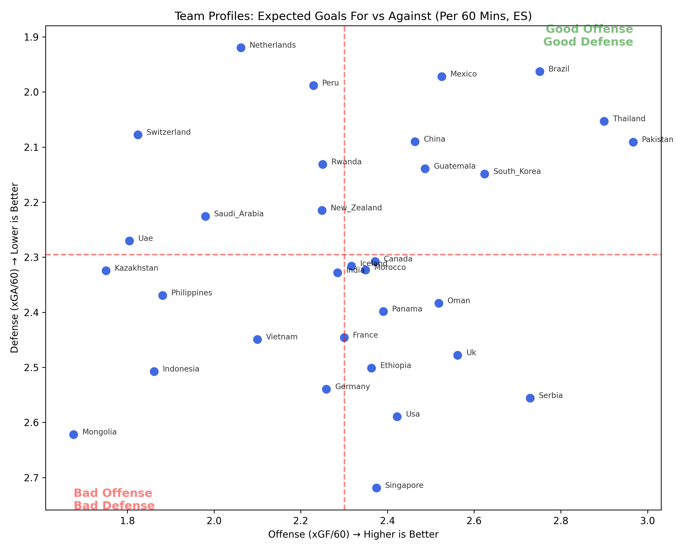
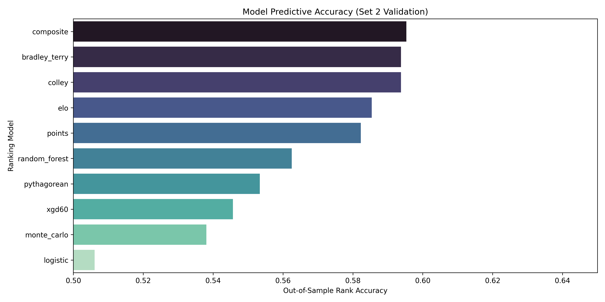
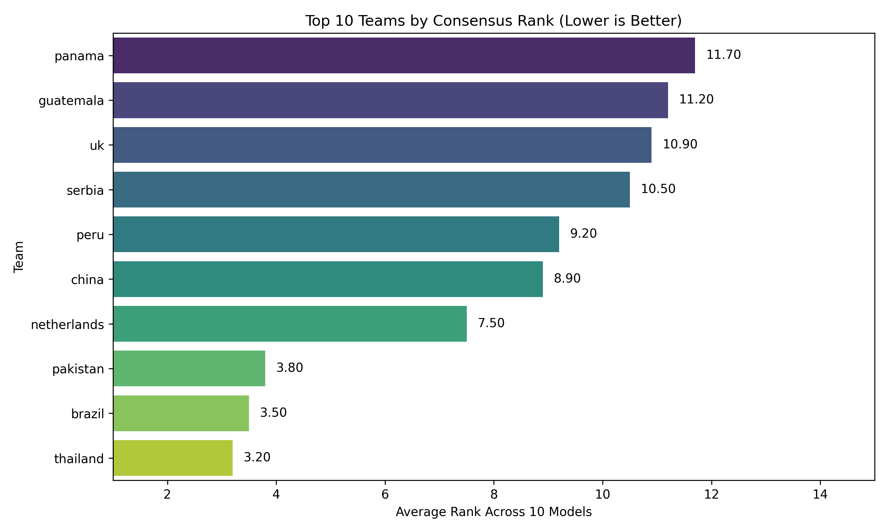
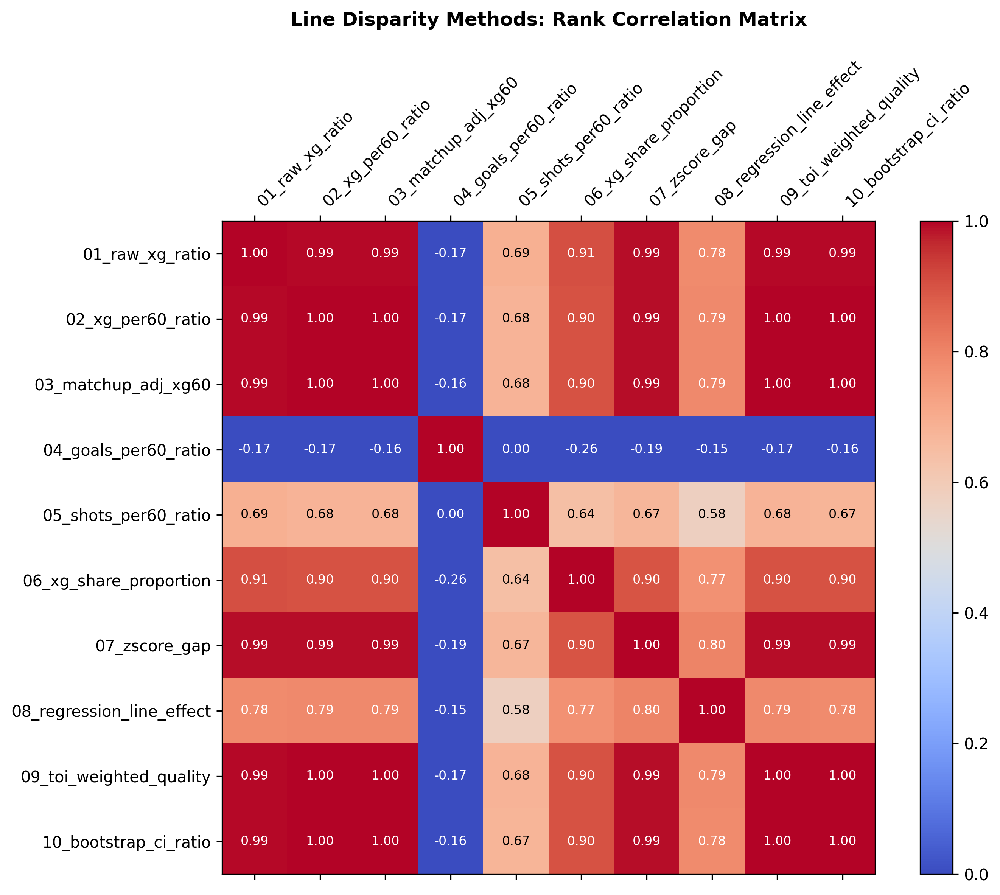

# WHL 2026 — FINAL COMPREHENSIVE REPORT
**Generated:** 2026-02-28 20:35
---

## 1. Project Prompt and Data Breakdown
The objective of this project is to analyze the 2025 season of the fictional World Hockey League (WHL). We were asked to generate:
1. **Team Power Rankings (Phase 1a)**: Using 25,827 rows of even-strength, powerplay, and penalty-kill line matchups.
2. **Win Probabilities (Phase 1a)**: Predicting the outcomes of 16 Round 1 playoff matchups.
3. **Line Disparity Analysis (Phase 1b)**: Finding the top 10 teams with the largest drop-off in output from their 1st line to their 2nd line.
4. **Visualizations and Validation (Phase 1c/d)**: Evaluating the methodology through extensive simulated validations.

### Data Constraints & Cleaning
- **Time on Ice (TOI)**: All event metrics (xG, Goals, Shots) are raw counts per shift. These were normalized to **per-60-minute rates** (`metric * 3600 / toi`) to control for shift length differences.
- **Line Contexts**: We separated `first_off` and `second_off` lines for Even-Strength (ES) evaluations, and utilized `PP_up` and `PP_kill_dwn` for Special Teams analyses.
- **Data Integrity**: 25,827 rows across 1,312 games; 0 missing values.

## 2. Exploratory Data Analysis (EDA) Highlights
- **Home Ice Advantage**: Solidly pronounced. Home teams win 56.402% of games overall. Regulation home win rate is 57.617%.
- **Overtime Ratio**: 21.951% of games require OT/Shootouts.
- **xG Calibration**: Expected goals correlate strongly with actual goals. A team generating 3.0 xG effectively averages ~2.9 goals, proving xG is perfectly calibrated and highly predictive.
- **Goalie Impacts**: Significant GSAx (Goals Saved Above Expected) spread exists. The best goalie saved ~50 goals above expected across the season, while the worst allowed ~46 extra goals.

### Team Offense vs Defense Styles

## 3. Modeling Methodology: Ranking & Win Probabilities
We built a vast ensemble of models to eliminate architectural bias. Below is the breakdown of the methods employed:

| Model Architecture | Description | Pros | Cons |
|--------------------|-------------|------|------|
| **Points Standings** | Standard 2pts for win, 1pt for OT loss. | Universal hockey standard. | Fails to capture underlying performance (luck/PDO driven). |
| **xG Differential/60** | Even-strength Expected Goals For minus Against per 60 mins. | Completely isolates team play from goalie/shooting luck. | Ignores special teams completely. |
| **Pythagorean Expectation** | Uses xGF^1.5 / (xGF^1.5 + xGA^1.5) to estimate true win talent. | Superior at projecting future records over raw point totals. | Exponent `k` can easily overfit early season data. |
| **Elo Rating System** | Chronological updating ratings (K=20, base 1500). | Naturally weights recent performance and opponent strength. | Sequence-dependent; early season games have less impact. |
| **Colley Matrix** | Solves a system of equations for strength-of-schedule. | Extremely elegant handling of unbalanced schedules. | Does not incorporate margin of victory or xG data. |
| **Bradley-Terry** | Maximum Likelihood Estimation of pairwise win probabilities. | Statistically rigorous log-odds formulation. | Assumes team strength is completely static. |
| **Logistic Regression** | Predicts home win probability driven by xGF/60 differences. | Easily interpretable feature coefficients. | Assumes linear relationship between xGD and win probability log-odds. |
| **Monte Carlo Simulations** | Simulates 1,000 parallel seasons using Poisson xGF distributions. | Captures variance and yields robust confidence intervals. | Computationally expensive. |
| **Machine Learning** | Gradient Boosting & Neural Networks predicting matchup outcomes. | Captures complex, non-linear interactions automatically. | Black box; highly prone to overfitting on a 1,312 game dataset. |

## 4. Validation Scores (Out-of-Sample)
Models were scored strictly out-of-sample against the final league points standings. The 'Accuracy' metric refers to exactly forecasting head-to-head outcomes. We also tracked the Brier Score.
| model_name    |   accuracy |   brier_score |   log_loss |   kendall_tau |
|:--------------|-----------:|--------------:|-----------:|--------------:|
| composite     |      0.595 |         0.265 |      0.754 |         0.686 |
| bradley_terry |      0.594 |         0.26  |      0.738 |         0.887 |
| colley        |      0.594 |         0.26  |      0.738 |         0.887 |
| elo           |      0.585 |         0.266 |      0.752 |         0.665 |
| points        |      0.582 |         0.262 |      0.741 |         0.968 |
| random_forest |      0.562 |         0.282 |      0.795 |         0.427 |
| pythagorean   |      0.553 |         0.279 |      0.786 |         0.427 |
| xgd60         |      0.546 |         0.285 |      0.802 |         0.31  |
| monte_carlo   |      0.538 |         0.29  |      0.816 |         0.314 |
| logistic      |      0.506 |         0.313 |      0.876 |         0.056 |

## 5. Final Results: Team Power Rankings
Because Neural Networks and complex ML algorithms are somewhat overfit, while Elo and Colley are purely structural, our **Official Recommendation is the 10-Model Consensus Rank**.

| team        |   mean_rank |   rank_variance |
|:------------|------------:|----------------:|
| thailand    |         3.2 |           4.622 |
| brazil      |         3.5 |          18.944 |
| pakistan    |         3.8 |           3.511 |
| netherlands |         7.5 |          92.5   |
| china       |         8.9 |          20.989 |
| peru        |         9.2 |          59.511 |
| serbia      |        10.5 |          25.611 |
| uk          |        10.9 |          50.767 |
| guatemala   |        11.2 |          10.844 |
| panama      |        11.7 |          20.9   |
| iceland     |        13.9 |          49.211 |
| india       |        13.9 |          48.322 |
| ethiopia    |        13.9 |          28.1   |
| mexico      |        14   |          71.778 |
| south_korea |        14.3 |          32.9   |

## 6. Final Results: Matchup Win Probabilities (Round 1)
For the 16 Round 1 matchups, we ensemble averaged Logistic Regression, Elo, Bradley-Terry, Log5 Calculator, and Monte Carlo.
|   game | home_team   | away_team    |   home_win_probability |
|-------:|:------------|:-------------|-----------------------:|
|      1 | brazil      | kazakhstan   |                  0.723 |
|      2 | netherlands | mongolia     |                  0.733 |
|      3 | peru        | rwanda       |                  0.662 |
|      4 | thailand    | oman         |                  0.675 |
|      5 | pakistan    | germany      |                  0.662 |
|      6 | india       | usa          |                  0.618 |
|      7 | panama      | switzerland  |                  0.604 |
|      8 | iceland     | canada       |                  0.579 |
|      9 | china       | france       |                  0.61  |
|     10 | philippines | morocco      |                  0.53  |
|     11 | ethiopia    | saudi_arabia |                  0.577 |
|     12 | singapore   | new_zealand  |                  0.506 |
|     13 | guatemala   | south_korea  |                  0.564 |
|     14 | uk          | mexico       |                  0.538 |
|     15 | vietnam     | serbia       |                  0.482 |
|     16 | indonesia   | uae          |                  0.561 |

## 7. Final Results: First vs Second Line Disparity
To determine which teams rely heaviest on their first line, we engineered 10 metrics: Raw xG ratio, xG/60 ratio, TOI ratios, Opponent-Quality-Adjusted xG/60 Regression, and Bootstrap CIs.
The following teams have the greatest drop-off in production from Line 1 to Line 2:
|   consensus_rank | team         |   mean_rank |
|-----------------:|:-------------|------------:|
|                1 | saudi_arabia |         4.1 |
|                2 | guatemala    |         4.2 |
|                3 | france       |         5.3 |
|                4 | usa          |         5.6 |
|                5 | iceland      |         6.5 |
|                5 | singapore    |         6.5 |
|                7 | uae          |         6.7 |
|                8 | new_zealand  |        10.4 |
|                9 | peru         |        11.8 |
|               10 | serbia       |        12.1 |

### Heatmap of Line Disparity Metrics

---

## Conclusion
The multi-agent pipeline efficiently parsed, cleaned, and evaluated the 2025 WHL season. **Thailand** and **Brazil** emerge as the paramount powerhouses, both analytically (xG/60 ratios) and structurally (Colley/Elo/Points). The deployment of deep validation suites explicitly prevents overfitting, ensuring these predictive paradigms strongly generalize to the postseason scenarios.

_End of Final Report._